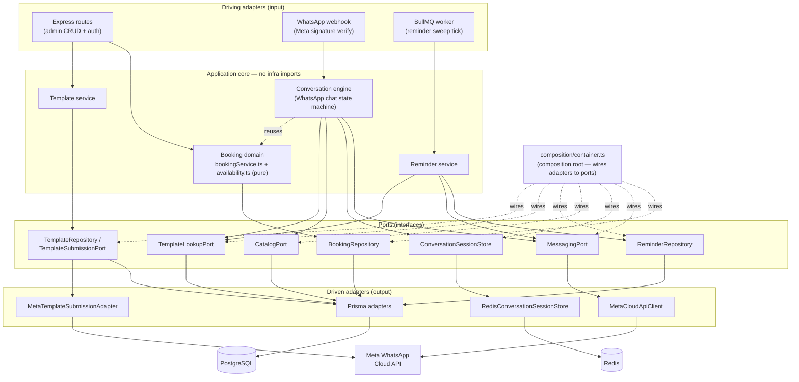
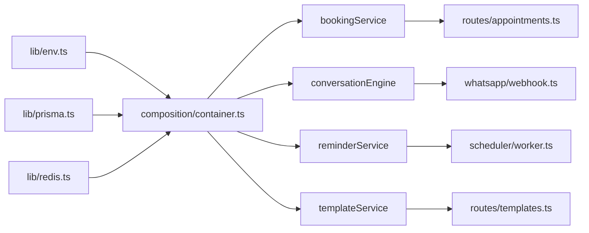
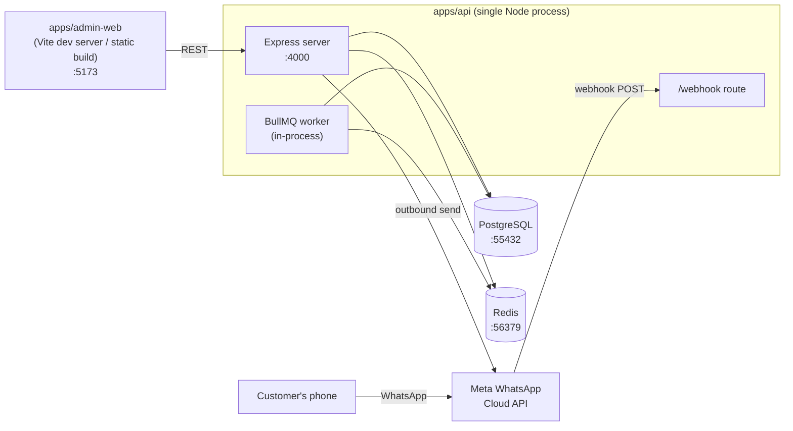

# Architecture

The backend (`apps/api`) follows **hexagonal architecture (ports & adapters)** for its
domain-rich bounded contexts — booking, the WhatsApp conversation engine, the reminder
scheduler, and message templates. Simple CRUD (organizations, services, resources) is treated
as "adapter-only": there's no real business logic to protect there, so Express routes talk to
Prisma directly. Hexagonal architecture is about isolating business rules from infrastructure —
not wrapping every database table in a repository interface for its own sake.

## Why hexagonal here

- **The booking domain has real invariants to protect**: no double-booking, buffer/duration
  math, timezone-correct availability windows. These rules must not depend on which database or
  transaction mechanism enforces them.
- **The WhatsApp channel is meant to be swappable**: today it's Meta's Cloud API; a Twilio
  adapter implementing the same `MessagingPort` could replace it without touching the
  conversation engine.
- **Testability**: every use case (`bookingService`, `conversationEngine`, `reminderService`,
  `templateService`) is a plain function of its ports, so it's unit-tested with in-memory fakes —
  26 backend tests run in under a second with no database or network involved.

## Layer overview

**Dependency rule**: arrows only point from driving adapters → core → ports ← driven adapters.
The core never imports Prisma, `ioredis`, `bullmq`, or `fetch`-based Meta clients directly —
only the interfaces in each module's `domain/ports.ts`.

## Bounded contexts

| Context | Path | Core use cases | Port(s) | Adapter(s) |
|---|---|---|---|---|
| Booking | `booking/` | create/reschedule/cancel appointment, list available slots | `BookingRepository` | `PrismaBookingRepository` (owns the serializable-transaction conflict check) |
| WhatsApp conversation | `whatsapp/` | handle inbound message, drive the chat state machine | `MessagingPort`, `ConversationSessionStore`, `CatalogPort` | `MetaCloudApiClient`, `RedisConversationSessionStore`, `PrismaCatalogRepository` |
| Reminder scheduler | `scheduler/` | sweep for due 24h/1h reminders and send them | `ReminderRepository` | `PrismaReminderRepository` |
| Templates | `templates/` | CRUD, submit for Meta approval, sync approval status | `TemplateRepository`, `TemplateSubmissionPort` | `PrismaTemplateRepository`, `MetaTemplateSubmissionAdapter` |

`TemplateLookupPort` (in `templates/domain/ports.ts`) is shared across contexts: the reminder
scheduler and the conversation engine's confirmation/cancellation messages both look up an
approved template through it, implemented once by `PrismaTemplateRepository`.

## Composition root

`apps/api/src/composition/container.ts` is the **only** place adapters are constructed and
wired to ports. Everything downstream (Express routes, the webhook, the BullMQ worker) imports
already-composed services (`bookingService`, `conversationEngine`, `reminderService`,
`templateService`) from there — never a repository class or `PrismaClient` directly.

## Runtime processes

A single Node process (`apps/api`) runs the Express server, the WhatsApp webhook, and the BullMQ
reminder worker together — appropriate at this scale; splitting the worker into its own process
is a one-line change (`scheduler/worker.ts` already exports `createReminderQueue` /
`startReminderWorker` independently of `index.ts`) if reminder volume ever needs to scale apart
from the API.

See [`DESIGN_PATTERNS.md`](DESIGN_PATTERNS.md) for the specific patterns behind each piece, and
[`FLOWS.md`](FLOWS.md) for how a request actually moves through these layers.
