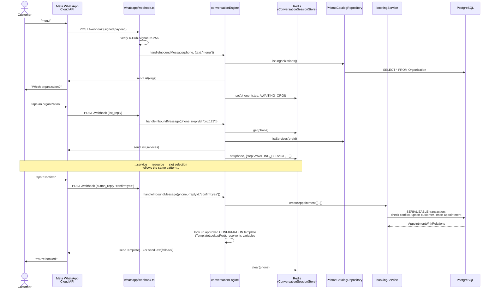
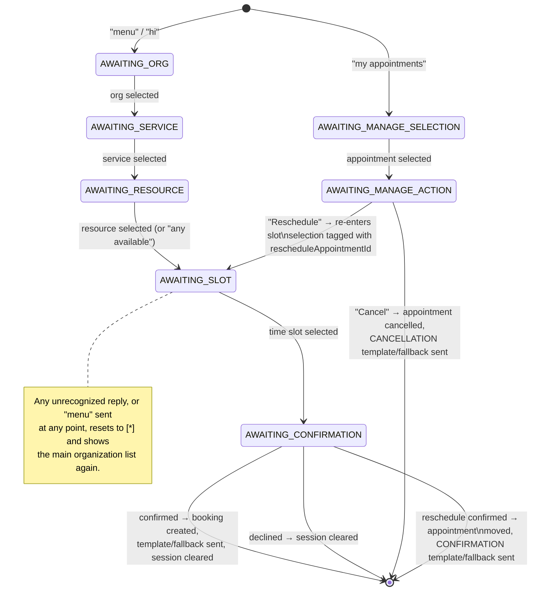
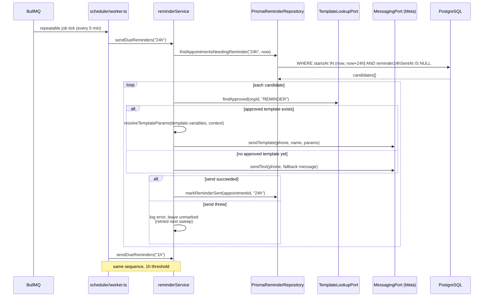
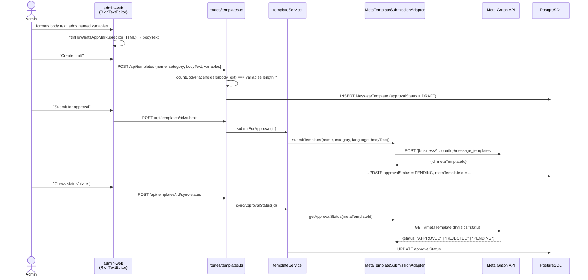

# Flow Diagrams

## 1. Booking an appointment over WhatsApp

The customer's phone never talks to our server directly — every message goes through Meta's
webhook. The conversation engine only ever talks to ports (`CatalogPort`, `BookingService`,
`MessagingPort`, `ConversationSessionStore`); this diagram shows the adapter each port call
actually resolves to at runtime.

## 2. Conversation state machine

`ConversationSession.step` drives which handler runs next. Two independent flows share state:
the "book something new" flow, and the "manage an existing appointment" flow — which can loop
back into slot selection when rescheduling.

## 3. Reminder scheduler sweep

Runs every 5 minutes regardless of API traffic. Each candidate's send/mark is independent — one
failure doesn't block the rest of the batch, and an unmarked reminder is naturally retried on the
next sweep instead of needing its own dead-letter queue.

## 4. Template creation and Meta approval

Template CRUD is plain admin-facing data management; only the two Meta-integration steps
(submit, sync status) go through the `templateService` use case and its
`TemplateSubmissionPort`.

